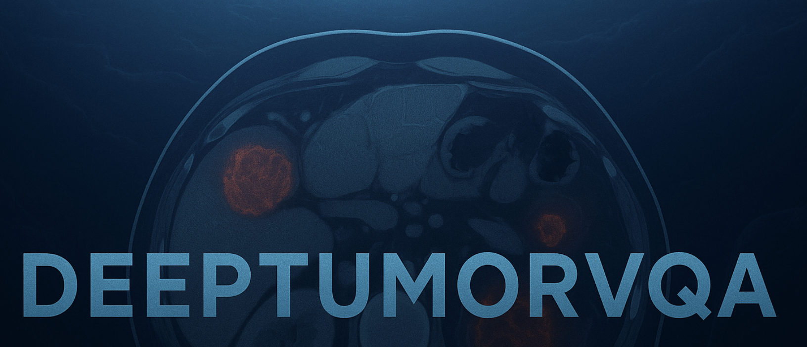
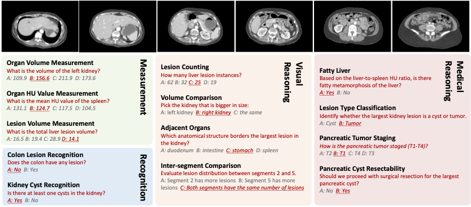

<div align="center">
    

<h1>Are Vision Language Models Ready for Clinical Diagnosis? A 3D Medical Benchmark for Tumor-centric Visual Question Answering</h1>
<h3><i>A Large-Scale Medical Visual Question Answering Benchmark</i></h3>


<p>
    
    <a href="https://huggingface.co/datasets/tumor-vqa/DeepTumorVQA_1.0" target="_blank">
        
    </a>
    <a href="https://arxiv.org/pdf/2505.18915" target="_blank">
        
    </a>
</p>

<div style="font-size: 0.9em; text-align: center;">

<a href="#" target="_blank">Yixiong Chen</a><sup>1</sup> •
<a href="#" target="_blank">Wenjie Xiao</a><sup>1</sup> •
<a href="#" target="_blank">Pedro R. A. S. Bassi</a><sup>1,2</sup> •
<a href="#" target="_blank">Xinze Zhou</a><sup>1</sup>

<a href="#" target="_blank">Sezgin Er</a><sup>3</sup> •
<a href="#" target="_blank">Ibrahim Ethem Hamamci</a><sup>3</sup> •
<a href="#" target="_blank">Zongwei Zhou</a><sup>1</sup> •
<a href="#" target="_blank">Alan Yuille</a><sup>1</sup>

</div>

<div style="font-size: 0.9em; text-align: center;">

<sup>1</sup> Johns Hopkins University &emsp;
<sup>2</sup> University of Bologna &emsp;
<sup>3</sup> Istanbul Medipol University  
<br/>
Contact: <a href="mailto:ayuille1@jhu.edu">ayuille1@jhu.edu</a>

</div>
</div>

---
<div align="center">
    
## 🧠 Overview


We present **DeepTumorVQA**, a diagnostic visual question answering (VQA) benchmark targeting abdominal tumors in CT scans. It comprises **9,262 CT volumes** (3.7M slices) from 17 public datasets, with **395K** expert-level questions spanning four categories: Recognition, Measurement, Visual Reasoning, and Medical Reasoning.



---


    
## 📄 Contents 


[Overview](#-overview)  
[Contents](#-contents)   
[Dataset Format](#-dataset-format)  
[Dataset Overview](#-dataset-overview)  
[Acknowledgement](#acknowledgement-and-disclosure-of-funding)  
[Citation](#citation)

---


## 📁 Dataset Format

</div>

Each example contains the following fields:


- `question_id`: A unique integer identifier for each VQA sample (e.g., `0`).
- `image_id`: A string identifier for the corresponding CT volume or slice (e.g., `BDMAP_00000001`).
- `spacing`: Image voxel spacing (e.g., `"[0.8222656 0.8222656 2.5 ]"`), stored as a string.
- `shape`: The image dimensions (e.g., `"(512, 512, 339)"`), stored as a string.
- `sex`: Binary patient sex (`Male`, `Female`).
- `age`: Patient age in years, stored as a float64 (e.g., `65.0`).
- `scanner`: Type of CT scanner used (e.g., `siemens`.
- `contrast`: Indicates use of contrast agent (`Non-contrast`, `Arterial`, `Venous`, etc.).
- `question`: A natural-language question about the image.
- `answer`: The corresponding expert-level answer to the question.
- `multiple_choice_question`: Reformulation of the question as a multiple-choice item.
- `correct_option`: The correct answer among multiple choices (a value from A to D).
- `organ`: The anatomical structure referenced in the question.
- `lesion`: The type of lesion involved (`tumor`, `cyst`, etc.).
- `question_type`: The general category of the question (`recognition`, `measurement`, `visual reasoning`, `medical reasoning`, etc.).
- `question_subtype`: A more granular subclassification (e.g., `lesion_counting`, `organ_hu_measurement`, `lesion_type_classification, etc.).
- `split`: Designates whether the sample belongs to the `train` or `validation` set.

---
<div align="center">
    
## 🧾 Dataset Overview

The following public abdominal CT datasets are included in **DeepTumorVQA**.  
Note: The number of volumes may differ from the original publications due to validation splits or removal of duplicates.

| Dataset (Year) [Source]                                                                                 | # of Volumes | # of Centers | Dataset (Year) [Source]                                                                                   | # of Volumes | # of Centers |
|----------------------------------------------------------------------------------------------------------|--------------|---------------|------------------------------------------------------------------------------------------------------------|--------------|---------------|
| 1. CHAOS (2018) [🔗](https://chaos.grand-challenge.org/Download/)                                        | 20           | 1             | 2. Pancreas-CT (2015) [🔗](https://academictorrents.com/details/80ecfefcabede760cdbdf63e38986501f7becd49) | 42           | 1             |
| 3. BTCV (2015) [🔗](https://www.synapse.org/#!Synapse:syn3193805/wiki/89480)                             | 47           | 1             | 4. LiTS (2019) [🔗](https://competitions.codalab.org/competitions/17094)                                  | 131          | 7             |
| 5. CT-ORG (2020) [🔗](https://wiki.cancerimagingarchive.net/pages/viewpage.action?pageId=61080890#61080890cd4d3499fa294f489bf1ea261184fd24) | 140          | 8             | 6. WORD (2021) [🔗](https://github.com/HiLab-git/WORD)                                                    | 120          | 1             |
| 7. AMOS22 (2022) [🔗](https://amos22.grand-challenge.org)                                                | 200          | 2             | 8. KiTS (2020) [🔗](https://kits-challenge.org/kits23/)                                                   | 489          | 1             |
| 9–14. MSD CT Tasks (2021) [🔗](https://decathlon-10.grand-challenge.org/)                                | 945          | 1             | 15. AbdomenCT-1K (2021) [🔗](https://github.com/JunMa11/AbdomenCT-1K)                                     | 1,050        | 12            |
| 16. FLARE’23 (2022) [🔗](https://codalab.lisn.upsaclay.fr/competitions/12239)                            | 4,100        | 30            | 17. Trauma Detect. (2023) [🔗](https://www.rsna.org/education/ai-resources-and-training/ai-image-challenge/abdominal-trauma-detection-ai-challenge) | 4,711        | 23            |
</div>

To facilitate alignment between our VQA dataset and the original CT image sources, we provide a mapping file that links each image ID in our dataset to its corresponding source identifier from the original Abdomen Atlas dataset.

You can view the ID mapping CSV here: [Abdomen_Atlas_ID_mapping.csv](./Data/AbdomenAtlas_ID_mapping.csv)

This file ensures traceability and reproducibility when working with external data references and annotations.

You may also email zzhou82@jh.edu for mapped full data and opportunities to collaborate in our future publications!


<div align="center">
    
## Acknowledgement and Disclosure of Funding

This work was supported by the Lustgarten Foundation for Pancreatic Cancer Research and the Patrick J. McGovern Foundation Award.

---

## Citation
</div>

```
@article{chen2025vision,
  title={Are Vision Language Models Ready for Clinical Diagnosis? A 3D Medical Benchmark for Tumor-centric Visual Question Answering},
  author={Chen, Yixiong and Xiao, Wenjie and Bassi, Pedro RAS and Zhou, Xinze and Er, Sezgin and Hamamci, Ibrahim Ethem and Zhou, Zongwei and Yuille, Alan},
  journal={arXiv preprint arXiv:2505.18915},
  year={2025}
}
```
---
 
