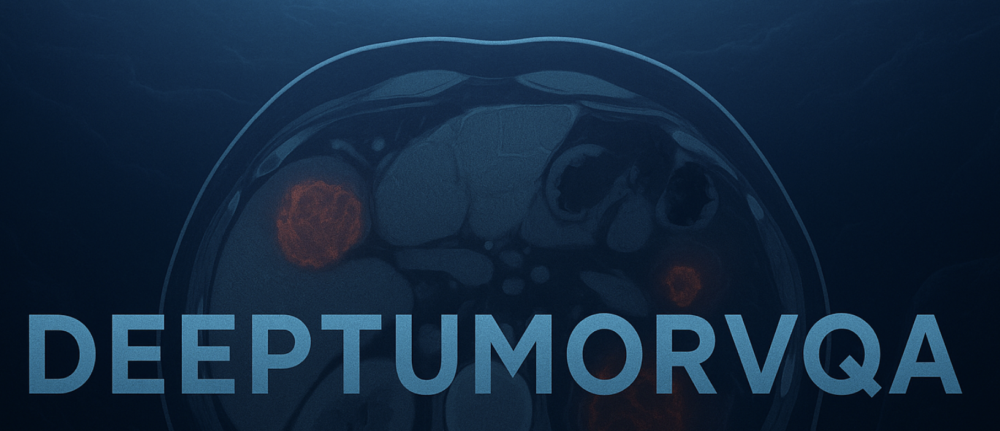

<div align="center">



# DeepTumorVQA v2

### *3D Medical Visual Question Answering — 42 clinical subtypes, 438K training + 10k testing QA pairs, agent + VLM evaluation*

<p>
    <a href="https://arxiv.org/abs/2505.18915" target="_blank">
        
    </a>
    <a href="https://huggingface.co/datasets/tumor-vqa/DeepTumorVQA_2.0" target="_blank">
        
    </a>
    <a href="LICENSE" target="_blank">
        
    </a>
    <a href="#license" target="_blank">
        
    </a>
</p>

</div>

3D abdominal-CT diagnostic Visual Question Answering benchmark with **42 clinical
subtypes** organized into 4 super-types: Recognition / Measurement / Visual
Reasoning / Medical Reasoning. Ships a **one-click evaluator** for both direct
VLM and tool-using agent settings, compatible with any HuggingFace VLM.

```
$ pip install deeptumorvqa
$ deeptumorvqa-eval --model Qwen/Qwen3-VL-4B-Instruct \
                    --mode vqa --input 2d_image --format mc \
                    --output results/qwen3vl.json

[deeptumorvqa] Overall accuracy: 37.84% on N=10000
  recognition          56.52%   (N=2023)
  measurement          29.21%   (N=2023)
  visual reasoning     38.71%   (N=4049)
  medical reasoning    25.04%   (N=1905)

>> 18  Qwen/Qwen3-VL-4B-Instruct  direct  37.8%  56.5%  29.2%  38.7%  25.0%
Your model ranks #18 of 31.
```

## Installation

```bash
pip install deeptumorvqa[vllm]    # recommended: vLLM backend (faster)
pip install deeptumorvqa[hf]      # alt:   HF transformers backend
pip install deeptumorvqa[openai]  # for agent mode (talks to vLLM OpenAI server)
pip install deeptumorvqa[all]     # all backends
```

## Tasks (42 subtypes)

| Super-type | # subtypes | # benchmark Q | Examples |
|---|---|---|---|
| **Recognition** | 9 | 2,023 | liver lesion existence, splenomegaly detection, PDAC/PNET existence |
| **Measurement** | 5 | 2,023 | organ volume, lesion volume, organ HU ratio, tumor burden % |
| **Visual Reasoning** | 16 | 4,049 | lesion clustering, kidney volume comparison, bilateral asymmetry |
| **Medical Reasoning** | 12 | 1,905 | hepatic steatosis grading, splenomegaly grading, PDAC vs PNET classification |

Full per-subtype breakdown in [metadata/subtype_schema.csv](metadata/subtype_schema.csv).

## Three input modalities

For direct VQA, the `--input` flag selects what the model sees:

| `--input` | Artifact | Use when |
|---|---|---|
| `3d_volume` | NIfTI (`.nii.gz`) | model has a 3D vision encoder (M3D, RadFM, Merlin) |
| `2d_image` | single axial PNG slice | most 2D VLMs (LLaVA, Qwen3-VL, MedGemma) |
| `2d_video` | MP4 of full CT volume | VLMs with native video input (Qwen3-VL, Gemini) |

Per-modality lazy download — `--input 2d_image` only fetches PNGs (~672 MB),
not the 30 GB CT folder.

## Three agent modes

For tool-using agent eval, the `--agent-mode` flag controls tool fidelity:

| `--agent-mode` | Tools | Note |
|---|---|---|
| `oracle` | segment + measure + lookup_knowledge (GT-mask values) | upper-bound: tests pure reasoning |
| `predicted` | same tools, TotalSegmentator-noised values | realistic deployment |
| `vision` | crop_organ + lookup_knowledge | no measurements; agent must visually estimate |

All three modes use **pre-computed tool caches**, so no live segmentation is
required. The `oracle` and `predicted` modes are pure-text after initialization;
`vision` mode reads pre-extracted organ-focused PNGs from `images_2d/organ/`.

## Plug in your own model

The CLI ships a Qwen3-VL reference implementation
([src/deeptumorvqa/reference/qwen3vl_vqa.py](src/deeptumorvqa/reference/qwen3vl_vqa.py)).
To plug in your own model, you implement **one method** — `generate(prompt,
images, video_path) -> str`. Everything else (dataset iteration, prompt
formatting, scoring, save/resume, leaderboard ranking) is provided.

Working `my_evaluator.py` showing how to wrap Qwen3-VL-4B with HF transformers:

```python
# my_evaluator.py
import torch
from PIL import Image
from transformers import AutoProcessor, Qwen3VLForConditionalGeneration

from deeptumorvqa.eval.vqa_evaluator import HFVLMEvaluator


class MyQwenEvaluator(HFVLMEvaluator):
    def __init__(self, model_id="Qwen/Qwen3-VL-4B-Instruct"):
        super().__init__(model_id=model_id)
        self.processor = AutoProcessor.from_pretrained(model_id, trust_remote_code=True)
        self.model = Qwen3VLForConditionalGeneration.from_pretrained(
            model_id, torch_dtype=torch.bfloat16, device_map="auto",
            trust_remote_code=True,
        ).eval()

    def generate(self, prompt: str, images=None, video_path=None) -> str:
        # Build a Qwen3-VL chat-template message with optional image content
        content = []
        if images:
            for im in images:
                content.append({"type": "image", "image": im})
        content.append({"type": "text", "text": prompt})
        messages = [
            {"role": "system", "content": self.system_prompt},
            {"role": "user", "content": content},
        ]
        text = self.processor.apply_chat_template(
            messages, tokenize=False, add_generation_prompt=True,
        )
        inputs = self.processor(
            text=[text], images=images or None, return_tensors="pt", padding=True,
        ).to(self.model.device)
        with torch.no_grad():
            out_ids = self.model.generate(**inputs, max_new_tokens=64, do_sample=False)
        gen = out_ids[:, inputs["input_ids"].shape[1]:]
        return self.processor.batch_decode(gen, skip_special_tokens=True)[0]


def build_evaluator(args):
    """The CLI calls this to construct your evaluator."""
    return MyQwenEvaluator()
```

```bash
deeptumorvqa-eval --backend custom --custom-module my_evaluator \
    --mode vqa --input 2d_image --format mc \
    --output results/my_vlm.json --label "MyQwenEvaluator"
```

For agent mode, subclass `AgentEvaluator` and implement `chat(messages,
tools) -> {content, tool_calls}` with OpenAI-style function calling. The
framework handles the ReAct loop and tool execution. See
[src/deeptumorvqa/reference/qwen3vl_agent.py](src/deeptumorvqa/reference/qwen3vl_agent.py)
for a working reference, and
[examples/03_custom_model.ipynb](examples/03_custom_model.ipynb) for both
patterns side-by-side.

## Reproducing paper numbers

```bash
# Qwen3-VL-4B direct VQA (paper: 37.8% Overall)
deeptumorvqa-eval --model Qwen/Qwen3-VL-4B-Instruct \
                  --mode vqa --input 2d_image --format mc \
                  --output results/qwen3vl_4b.json

# Qwen3.5-9B agent oracle (paper: 48.5% Overall)
# First start a vLLM server in another terminal:
python -m vllm.entrypoints.openai.api_server \
    --model Qwen/Qwen3.5-9B --port 8877 \
    --enable-auto-tool-choice --tool-call-parser hermes

deeptumorvqa-eval --model Qwen/Qwen3.5-9B \
                  --backend openai --api-base http://localhost:8877/v1 \
                  --mode agent --agent-mode oracle --format mc \
                  --output results/qwen35_agent.json
```

Expected accuracies are within ±1 pp of the paper values for full 10K runs.

## Local data mode (offline / repeated runs)

```bash
# First time — downloads everything you need from HF:
deeptumorvqa-eval --mode vqa --input 2d_image --format mc \
                  --cache-dir ~/.cache/huggingface \
                  --output results/run1.json

# Or pre-fetch the dataset once and use --data-dir:
huggingface-cli download tumor-vqa/DeepTumorVQA_2.0 \
    --repo-type dataset \
    --local-dir /mnt/datasets/DeepTumorVQA_2.0

deeptumorvqa-eval --mode vqa --input 2d_image --format mc \
                  --data-dir /mnt/datasets/DeepTumorVQA_2.0 \
                  --output results/run1.json
```

## Leaderboard

After every full eval, the CLI prints where your model ranks among the 30
models reported in the paper. Submission to the public leaderboard: open a PR
modifying [metadata/leaderboard.csv](metadata/leaderboard.csv) with your eval
result file attached.

## Citation

```bibtex
@article{chen2026deeptumorvqa,
  title={DeepTumorVQA: A Hierarchical 3D CT Benchmark for Stage-Wise Evaluation of Medical VLMs and Tool-Augmented Agents},
  author={Chen, Yixiong and Xiao, Wenjie and Bassi, Pedro RAS and Wang, Boyan and He, Liang and Zhou, Xinze and Er, Sezgin and Hamamci, Ibrahim Ethem and Zhou, Zongwei and Yuille, Alan},
  journal={arXiv preprint arXiv:2605.09679,
  year={2026}
}
```

## License

- **Code** (this repository): Apache-2.0 (see [LICENSE](LICENSE))
- **DeepTumorVQA annotations, structured metadata, and benchmark questions**
  (`benchmark/test_qa.json`, `train/train_qa.csv`, `agent_sft/*.jsonl`,
  `tool_cache/*.json`, `metadata/*.csv`): CC-BY-4.0 — attribution required,
  unrestricted research use
- **Pre-computed 2D slices, videos, and 3D arrays derived from source CT
  volumes** (`benchmark/images_2d/`, `benchmark/videos/`, `benchmark/ct/`,
  `train/images_2d/`, `train/videos/`): governed by the **respective source
  CT licenses** — see [AbdomenAtlas3.0Mini](https://huggingface.co/datasets/AbdomenAtlas/AbdomenAtlas3.0Mini)
  for the upstream terms; the processing scripts in this repo let users
  regenerate these locally if needed
- **Underlying CT NIfTI volumes**: governed by their respective source-dataset
  licenses; users must comply with each source's terms of use
