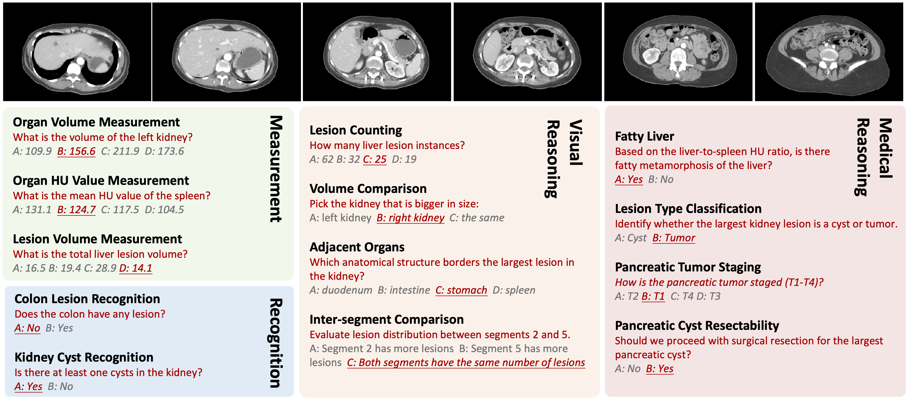

<div align="center">

<h1>DeepTumorVQA 1.0</h1>
<h3><i>A Large-Scale Medical Visual Question Answering Benchmark</i></h3>



<p>
<a href="https://huggingface.co/datasets/tumor-vqa/DeepTumorVQA_1.0" target="_blank">
    
</a>
</p>

<div style="font-size: 0.9em; text-align: center;">

<a href="#" target="_blank">Yixiong Chen</a><sup>1</sup> •
<a href="#" target="_blank">Pedro R. A. S. Bassi</a><sup>1,2</sup> •
<a href="#" target="_blank">Wenjie Xiao</a><sup>1</sup> •
<a href="#" target="_blank">Xinze Zhou</a><sup>1</sup> •
<a href="#" target="_blank">Sezgin Er</a><sup>3</sup> •
<a href="#" target="_blank">Ibrahim Ethem Hamamci</a><sup>3</sup> •
<a href="#" target="_blank">Zongwei Zhou</a><sup>1</sup> •
<a href="#" target="_blank">Alan Yuille</a><sup>1</sup>

</div>

<div style="font-size: 0.9em; text-align: center;">

<sup>1</sup> Johns Hopkins University &emsp;
<sup>2</sup> University of Bologna &emsp;
<sup>3</sup> Istanbul Medipol University  
<br/>
Contact: <a href="mailto:ayuille1@jhu.edu">ayuille1@jhu.edu</a>

</div>

---

## 🧠 Overview
We present **DeepTumorVQA**, a diagnostic visual question answering (VQA) benchmark targeting abdominal tumors in CT scans. It comprises **9,262 CT volumes** (3.7M slices) from 17 public datasets, with **395K** expert-level questions spanning four categories: Recognition, Measurement, Visual Reasoning, and Medical Reasoning.

---
## 📄 Contents 
- [Overview](#)
- [Contents](#contents)
- [Dataset Format](#dataset-format)
- [Dataset Overview](#dataset-overview)
- [RUN Your Own Evaluation](#run-your-own-evaluation)
  - [Benchmark](#benchmark)
  - [Installation](#installation)
  - [Evaluation](#evaluation)
- [Acknowledgement](#acknowledgement)
- [Citation](#citation)

---

## 📁 Dataset Format

Each example contains the following fields:

- `image`: Path or identifier for the CT image or volume
- `question`: A natural-language question about the image
- `answer`: The corresponding answer (expert-level)
- (Optional: metadata like `modality`, `region`, `split`, etc.)

---
  
## 🧾 Dataset Overview

The following public abdominal CT datasets are included in **DeepTumorVQA**.  
Note: The number of volumes may differ from the original publications due to validation splits or removal of duplicates.

| Dataset (Year) [Source]                                                                                 | # of Volumes | # of Centers | Dataset (Year) [Source]                                                                                   | # of Volumes | # of Centers |
|----------------------------------------------------------------------------------------------------------|--------------|---------------|------------------------------------------------------------------------------------------------------------|--------------|---------------|
| 1. CHAOS (2018) [🔗](https://chaos.grand-challenge.org/Download/)                                        | 20           | 1             | 2. Pancreas-CT (2015) [🔗](https://academictorrents.com/details/80ecfefcabede760cdbdf63e38986501f7becd49) | 42           | 1             |
| 3. BTCV (2015) [🔗](https://www.synapse.org/#!Synapse:syn3193805/wiki/89480)                             | 47           | 1             | 4. LiTS (2019) [🔗](https://competitions.codalab.org/competitions/17094)                                  | 131          | 7             |
| 5. CT-ORG (2020) [🔗](https://wiki.cancerimagingarchive.net/pages/viewpage.action?pageId=61080890#61080890cd4d3499fa294f489bf1ea261184fd24) | 140          | 8             | 6. WORD (2021) [🔗](https://github.com/HiLab-git/WORD)                                                    | 120          | 1             |
| 7. AMOS22 (2022) [🔗](https://amos22.grand-challenge.org)                                                | 200          | 2             | 8. KiTS (2020) [🔗](https://kits-challenge.org/kits23/)                                                   | 489          | 1             |
| 9–14. MSD CT Tasks (2021) [🔗](https://decathlon-10.grand-challenge.org/)                                | 945          | 1             | 15. AbdomenCT-1K (2021) [🔗](https://github.com/JunMa11/AbdomenCT-1K)                                     | 1,050        | 12            |
| 16. FLARE’23 (2022) [🔗](https://codalab.lisn.upsaclay.fr/competitions/12239)                            | 4,100        | 30            | 17. Trauma Detect. (2023) [🔗](https://www.rsna.org/education/ai-resources-and-training/ai-image-challenge/abdominal-trauma-detection-ai-challenge) | 4,711        | 23            |

---
## 🔍 Example Entry

```json
{
  "image": "vol_01348_slice_57.png",
  "question": "Is there evidence of a lesion in the right kidney?",
  "answer": "No"
}

```

## Acknowledgement and Disclosure of Funding

This work was supported by the Lustgarten Foundation for Pancreatic Cancer Research and the Patrick J. McGovern Foundation Award.

---
## Citation

@article{Schuture,
    title={{Are Vision Language Models Ready for Clinical Diagnosis? A 3D Medical Benchmark for Tumor-centric Visual Question Answering}},
    author={Yixiong Chen, Pedro R. A. S. Bassi, Wenjie Xiao, Xinze Zhou, Sezgin Er, Ibrahim Ethem Hamamci, Zongwei Zhou, Alan Yuille},
    year={2025},
    journal={ToBePublished},
}

---
 
